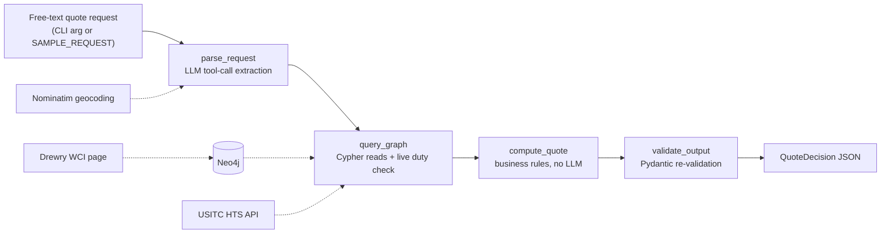
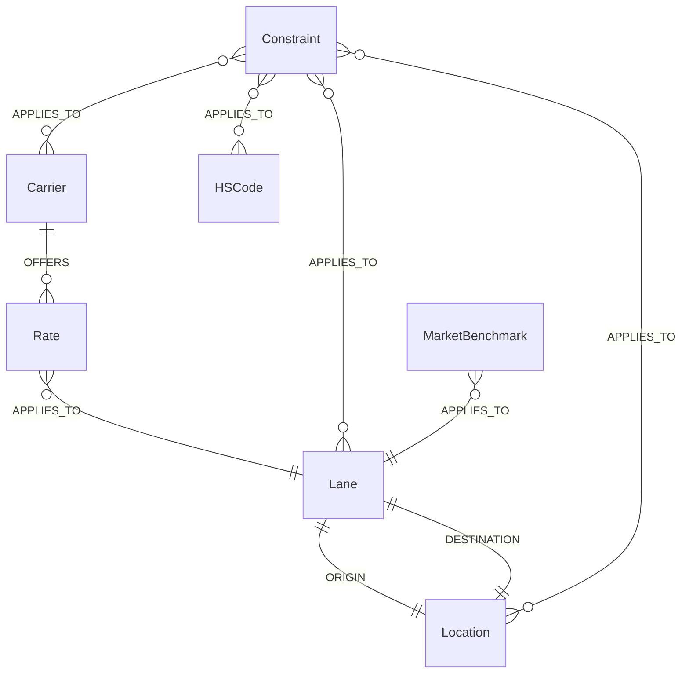

# Project Guide — Freight Quote Agent (interview prep, not a graded deliverable)

This is a reference document for you, not part of the assignment submission.
It covers what's used and where, why it was chosen over alternatives, the
schema/architecture, and likely interview questions with answer angles.

---

## 1. Architecture overview



The four nodes are a `langgraph.graph.StateGraph` (`src/agent/graph_agent.py:312-326`).
Each node takes the whole `AgentState` dict and returns a merged copy — no
node holds a driver/client past its own function call (open, use, close).

**The one rule that shapes everything else**: the LLM only ever *extracts*
fields from text (query parsing) or *fetches* a single external fact (duty
rate, market rate). It never decides the quote — that's %100 Python/Cypher
in `compute_quote`. This is what the assignment asked for ("query Neo4j, not
stuff the CSV into the prompt") and it's also what makes the system testable
without hitting the LLM at all (see `tests/test_agent.py`).

---

## 2. Tech stack: what's used, where, why, and the alternative

| Technology | Where in the codebase | Why chosen | Alternative(s) considered |
|---|---|---|---|
| **Neo4j** (graph DB) | `docker-compose.yml`, `src/graph/`, `src/ingest/load_graph.py` | Assignment requirement; relationships (carrier→rate→lane, constraint→multiple targets) are the natural query shape here — Cypher pattern-matching reads like the domain model | PostgreSQL + recursive CTEs (works, but compliance-rule polymorphism gets ugly in SQL); Amazon Neptune / ArangoDB (viable, no reason to leave Neo4j for a project this size) |
| **LangGraph** (`langgraph.graph.StateGraph`) | `src/agent/graph_agent.py:312-326` | Assignment mentioned it as their framework; a 4-node linear graph doesn't *need* an orchestrator, but it gives a visualizable, extensible pipeline (easy to add branches later, e.g. a retry node) | A plain Python function pipeline (`parse(x) |> query |> compute |> validate`) would work identically for this linear a flow — LangGraph earns its keep once you need branching/cycles, which this doesn't yet have |
| **Groq** (LLM provider, default) | `src/agent/graph_agent.py:59-78`, `src/config.py:13-14` | Free tier, fast, OpenAI-compatible tool-calling API; assignment explicitly allows "free-tier / small-model setup" | Anthropic Claude (also wired in, `LLM_PROVIDER=anthropic`, see `_extract_via_anthropic`); local Ollama (assignment's other suggested option — not used because the user's hardware couldn't run it without Colab, which added more moving parts than Groq) |
| **`openai/gpt-oss-120b`** (Groq model) | `src/config.py:14` | Measured: 0/10 malformed tool-calls vs `llama-3.3-70b-versatile`'s ~70% failure rate on some prompts (see §6) — a correctness-driven choice, not a default | `llama-3.3-70b-versatile` (faster, much less reliable at structured output in testing) |
| **Pydantic** (`BaseModel`, `model_validator`) | `src/agent/models.py` | Assignment explicitly asks for "a validated JSON object (e.g., Pydantic)"; the `@model_validator` in `QuoteDecision` (`models.py:42-56`) enforces the chosen carrier actually appears in alternatives with `status="valid"` — a real invariant, not just type-checking | `dataclasses` + hand-written `__post_init__` validation (more boilerplate, no automatic JSON schema); `attrs`+`cattrs` |
| **pandas** | `src/ingest/clean.py:load_rates` | CSV → DataFrame → vectorized `.map()` cleaning is the standard tool for tabular ETL of this size | Raw `csv` module (fine at 8 rows, but pandas' `dtype`/`keep_default_na` handling was the actual mechanism used to preserve `None` vs coerce to `NaN` deliberately — see the `_none_if_nan` helper in `load_graph.py:24-30`, which exists *because* pandas silently upgrades a None-containing numeric column to float64 NaN) |
| **pytest** | `tests/` | Standard; fixtures (`tests/test_queries.py:15-30`) cleanly express "skip if Neo4j unreachable" and "seed only if empty" | `unittest` (more boilerplate, no `pytest.skip`/fixture ergonomics) |
| **Docker / docker-compose** | `docker-compose.yml`, `Dockerfile` | Assignment's provided starting point; reproducible Neo4j instance without a local install | Neo4j Aura Free (a hosted alternative — considered and discussed, not used for the final deliverable since the assignment's own docker-compose is what graders will run) |
| **`requests`** (HTTP client, external adapters) | `src/ingest/external/*.py` | Simple, synchronous, no async needed for one-off lookups | `httpx` (already a transitive dependency via `anthropic`/`groq` SDKs — not used directly to avoid a second HTTP client convention) |
| **Nominatim / OpenStreetMap** (geocoding) | `src/ingest/external/geocode.py` | Free, unauthenticated, real-time — the only source needed since `resolve_request_location` only needs a name/country, not a full ports database | Full **UN/LOCODE** dataset (~100k entries, free download) — the "real" answer for scaling to global coverage, not implemented because a live per-request geocode call was a smaller, bounded fix for the immediate crash-on-unknown-city bug |
| **USITC HTS search API** (tariff data) | `src/ingest/external/tariff_lookup.py` | Real, free, government-authoritative duty rates for any HS code — but US-only and undocumented (same endpoint the hts.usitc.gov search box calls) | USITC DataWeb's registered API (more stable contract); per-country tariff APIs for non-US destinations (roadmap item, not built); paid aggregators (Avalara, Descartes) for full global coverage |
| **Drewry World Container Index** (market benchmark, scraped) | `src/ingest/external/market_rate_scraper.py` | Only free, public source found with real per-lane numbers in plain narrative text | Freightos Baltic Index / Xeneta (both paid APIs — the "real" production answer; scraping one webpage's prose is explicitly flagged in the module docstring as the fragile part) |
| **regex** (not NER/spaCy) | `src/ingest/clean.py:129-144` (`_DUTY_RE`, `_FILING_RE`, `_SUSPENSION_RE`), `market_rate_scraper.py:24-29` (`_LANE_SENTENCE`) | 3 known sentence shapes in a static file; a hand-written pattern per shape is more debuggable and has zero hallucination risk vs. an LLM extraction pass | An LLM extraction pass over free text (what `parse_request` does for the *query* side) — flagged in the code comment as the natural upgrade path if customs-note sentence shapes become unpredictable at scale |

---

## 3. Graph schema (condensed — full rationale in `graph_schema.md`)

**Nodes**: `Location` (canonical city/country, aliases resolved at ingestion),
`Carrier`, `Lane` (derived `origin-destination` join point, not a CSV column),
`Rate` (one node per CSV row — weight break + price + validity live directly
on it), `HSCode`, `Constraint` (generic compliance rule: `predicate` +
`scope_attribute`/`scope_value` + polymorphic `APPLIES_TO`), `MarketBenchmark`
(added later, reuses the same `APPLIES_TO` pattern).



**Why `APPLIES_TO` is reused everywhere**: it's deliberate polymorphism — a
`Constraint` scoped to a carrier+lane (hazmat hold) and one scoped to a
location+HS code (duty surcharge) use the *same* relationship type pointing
at different node label combinations, so a new rule type or a new node type
(`MarketBenchmark`) never requires a schema migration, just a new query.

**Weight-break selection rule** (the single most important piece of query
logic, and the one most worth being able to explain cold): for a shipment of
weight *W*, the applicable tier is the **highest** `weight_break_kg` that is
**≤ W**, per carrier, among rates valid on the ship date. A 250kg shipment
does *not* qualify for a 300kg-break rate. This is implemented via
`ORDER BY rate.weight_break_kg DESC` immediately before a `collect(rate)[0]`
aggregation grouped implicitly by carrier (`src/graph/queries.py:15-17`) —
Cypher preserves row order from a preceding `ORDER BY` into `collect()`,
which is what makes `[0]` deterministically "the highest qualifying tier."

---

## 4. Codebase map

```
data/rates.csv, customs_notes.txt      Assignment's synthetic source data
src/config.py                          Env-driven config (Neo4j, Groq/Anthropic, provider switch)
src/ingest/
  clean.py                             Alias table + geocode fallback (resolve_request_location),
                                        date parsing, regex customs-note parser
  load_graph.py                        Cypher writes: schema constraints, Rate/Constraint ingestion
  enrich_external.py                   Separate "refresh" step: live duty + market data -> graph
  external/geocode.py                  Nominatim geocoding adapter
  external/tariff_lookup.py            USITC HTS duty-rate adapter
  external/market_rate_scraper.py      Drewry WCI scraper
src/graph/
  schema.cypher                        Constraints + indexes for every node label
  queries.py                           find_applicable_rates, get_active_holds_for_lane,
                                        get_compliance_flags, get_market_benchmark
src/agent/
  state.py                             AgentState / QuoteRequest TypedDicts
  graph_agent.py                       The 4-node LangGraph pipeline (see §1)
  models.py                            QuoteDecision, RateOption, NoLaneDataError
src/main.py                            CLI entrypoint (accepts a prompt as argv, or SAMPLE_REQUEST)
tests/
  test_ingest.py                       Pure-Python cleaning/parsing checks
  test_agent.py                        Pure-Python decision-logic checks (synthetic state, no LLM/DB)
  test_queries.py                      Live Cypher regression checks (needs Neo4j; seeds only if empty)
  test_external.py, test_geocode.py    Live checks against the three real external sources
```

---

## 5. Known limitations (say these proactively, don't wait to be asked)

- Only 2 lanes (SHA→NYC, SHA→LAX) have real carrier rate data — anything
  else correctly returns "no data," never a fabricated quote.
- Live duty check is **US-destination-only** (USITC is a US data source).
- Live market benchmark is **Shanghai-origin-only** (Drewry only publishes
  those lanes).
- `computed_cost` is base ocean freight only — duty/fees are separate
  warning text, never summed into a landed-cost total.
- No currency conversion, no container/volumetric-weight rules, no
  booking/availability — this is a quote estimator, not a TMS.
- LLM tool-calling reliability is provider/model-dependent, mitigated with a
  retry loop, not eliminated (see §6).
- Running `pytest` only re-seeds the graph if it's empty (fixed from an
  earlier version that unconditionally wiped it) — but a fresh
  `docker compose up` + first `load_graph` run still needs to happen before
  enrichment.

---

## 6. Interview questions you should be ready for

### Schema design
- **"Why is `Rate` a node instead of a property on a `Carrier`→`Lane` edge?"**
  A single (carrier, lane) pair has multiple rates (one per weight break,
  sometimes overlapping validity windows) — an edge can hold one scalar
  property, not an unbounded set of priced tiers.
- **"Why generic `Constraint` instead of `HazmatSuspension`/`DutySurcharge` typed nodes?"**
  Compliance rules grow unpredictably (new predicate types, new scopes) —
  a generic node with `predicate` + polymorphic `APPLIES_TO` absorbs new
  rule types with zero schema change, at the cost of self-documentation
  (no relationship literally named `ON_LANE`).
- **"Why derive `Lane` instead of just having `Rate` point at two `Location` nodes directly?"**
  Both `Rate` and `Constraint` need to reference "this lane" as a single
  unit (the hazmat hold is scoped to lane, not to either endpoint alone) —
  anchoring both to one `Lane` node avoids duplicating origin/destination
  logic in every query and keeps lane-level checks to one traversal.
- **"What would you change if this were real production data?"**
  Composite/versioned rate history (`SUPERSEDES` chain instead of just
  overlapping validity windows), a real HS taxonomy instead of one ad-hoc
  `HSCode` node, incremental MERGE-based ingestion instead of full reset.

### Query logic
- **"Walk me through how you pick the right weight-break tier."**
  See §3 — highest `weight_break_kg` ≤ shipment weight, per carrier, via
  `ORDER BY ... DESC` before `collect(rate)[0]`. Ask them to probe the
  boundary case (weight exactly equal to a break) — inclusive, `<=` not `<`.
- **"How do you avoid recommending a carrier that's excluded, or an
  unpriced tier?"** Cypher returns the fact (on_hold flag, null price);
  Python (`compute_quote`) decides to exclude — deliberately kept out of
  Cypher so the exclusion *reason* text lives in one readable place.
- **"What's the difference between your two 'no quote' error paths?"**
  `NoLaneDataError` (zero rate rows *and* zero holds — no carrier ever
  served this lane) vs. plain `ValueError` (rows exist, all excluded) —
  different real-world meanings, deliberately not conflated.

### Agent / LLM design
- **"Why does the LLM only extract fields instead of reasoning about the quote?"**
  Determinism and testability — `compute_quote`'s tests run with zero LLM
  calls using synthetic dicts (`tests/test_agent.py`), and the actual price
  math never depends on model sampling.
- **"What happens if the LLM hallucinates or fails?"**
  Two concrete, measured failure modes fixed during testing: (1) forced
  tool-calling made the model *fabricate* a shipment for off-topic input —
  fixed by switching to `tool_choice="auto"` plus a system instruction to
  decline; (2) `llama-3.3-70b-versatile` had a ~70% malformed-JSON rate on
  some prompts — fixed by switching to `openai/gpt-oss-120b` (0/10 failures
  in the same test) plus a 4-attempt retry loop as a second layer of defense.
- **"Why LangGraph instead of a plain function pipeline?"** Honest answer:
  for this linear a flow, a plain pipeline would work identically — LangGraph
  starts earning its keep once you need conditional branching or cycles
  (e.g. a re-ask-the-user step), which this doesn't have yet.

### Data engineering / messy data
- **"How did you handle the two date formats?"** Two regexes
  (`_ISO_DATE`, `_DMY_DATE`) tried in sequence in `parse_date` — deliberately
  explicit rather than a fuzzy date parser, so an unrecognized format raises
  loudly instead of silently misparsing day/month.
- **"How did you avoid losing the missing SwiftCargo rate?"** Read with
  `keep_default_na=False` so blank cells become empty strings, mapped to
  `None` explicitly — and pandas' *own* numeric-column NaN coercion is
  handled at the Neo4j-write boundary (`_none_if_nan`), not fought inside
  pandas itself.
- **"Why regex for customs notes but an LLM for the query request?"** See
  tech-stack table §2 — 3 known fixed sentences vs. unbounded free text.

### Testing / correctness
- **"How do you know the weight-break logic is actually correct?"**
  `tests/test_queries.py` runs the real Cypher against a live Neo4j and
  asserts a 250kg shipment gets the 45kg tier (not 300kg) while a 300kg
  shipment gets the 300kg tier — both directions of the boundary, against
  the real query, not a mock.
- **"Why do some tests skip instead of fail?"** `test_queries.py` skips if
  Neo4j isn't reachable, `test_external.py`/`test_geocode.py` skip if a
  third-party source is unreachable/changed shape — a None result from a
  live external dependency is inconclusive, not a code defect.

### Scaling / "what's next"
- **"How would you scale this to real global freight data?"** Data
  acquisition is the hard part (paid carrier-rate contracts, per-country
  tariff adapters, a full UN/LOCODE dataset, paid market-index
  subscriptions) — not something more scraping solves. Schema-wise, the
  generic `Constraint` model already scales to new countries/rule types
  without migration; ingestion would need to move from full-reset to
  incremental MERGE-based upserts once it runs on a schedule.
- **"Why not just scrape more sites for more lanes?"** Explicitly rejected
  in the roadmap — unreliable, likely ToS-violating at volume, and not how
  the freight industry actually sources rates at scale (real forwarders use
  contracts/EDI, not scraping).
